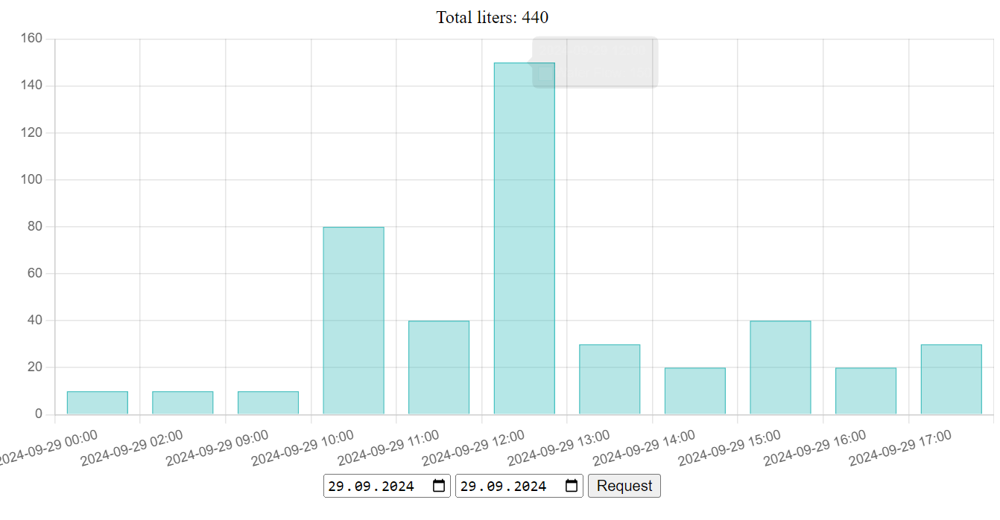

# Мониторинг расхода воды

---

### Описание:

Just for fun.

Счетчик воды (далее СВ) имеет импульсный выход, который замыкается каждые 10 литров.
Пин esp подключен к 3.3В через СВ, и подтянут через резистор 10кОм к земле для устранения дребезга. Когда выход СВ замыкается, на пин поступает высокий сигнал. После размыкания (когда высокий сигнал пропадает), отправляется сообщение в MQTT брокер. Даллее сервер подписанный на соответствующий MQTT топик, записывает данные в бд. На сервере реализовано простое REST API.

---

#### Внешний вид:

Реализован простой фронтенд для отображения базовой информации. Можно запросить информация с точностью до дня. Отображается колличество литров по часам.

---

### Технологии:

#### Frontend:

#### Backend:

#### Firmware:

---
